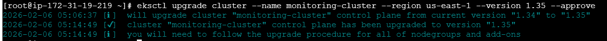
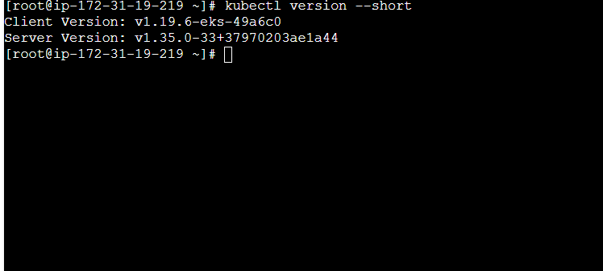
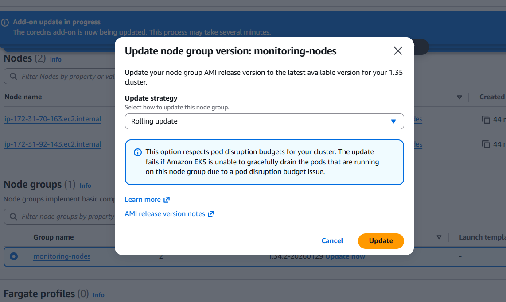
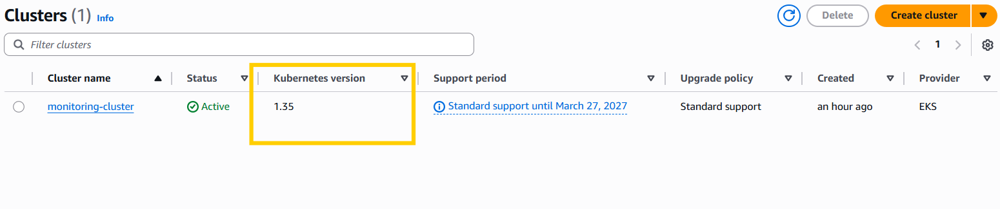

## Once check all the upgrade pre-requisties follow the below process.


## 1. Upgrade EKS Control Plane

Upgrade the EKS control plane to Kubernetes 1.35.

```bash
eksctl upgrade cluster \
  --name monitoring-cluster \
  --region us-east-1 \
  --version 1.35 \
  --approve
```

 ### Notes

- This upgrades only the control plane

- Worker nodes remain on the old version (1.34)

- No application downtime expected

## 2. Verify Control Plane Upgrade

```
aws eks describe-cluster \
  --name monitoring-cluster \
  --region us-east-1 \
  --query "cluster.version" \
  --output text
  ```

  


## 3. Update EKS Add-ons (AWS Console)

After the control plane upgrade to Kubernetes 1.35 is completed, update all EKS managed add-ons to ensure compatibility.

### Navigate to Add-ons
1. Open **Amazon EKS Console**
2. Select **monitoring-cluster**
3. Go to **Add-ons**

---

### Update Core Add-ons

Update the following add-ons **one by one**:

- Amazon VPC CNI (`aws-node`)
- CoreDNS
- kube-proxy

#### Steps
1. Click the add-on name
2. Select **Edit**
3. Choose the **latest version compatible with Kubernetes 1.35**
4. Conflict resolution:
   - Select **Preserve**
5. Click **Save changes**

⚠️ Do not proceed until all add-ons show **Active** status.

---

### Verify Add-ons Health

```bash
kubectl get pods -n kube-system
```


## 4. Upgrade Managed Node Groups (AWS Console)

After completing the control plane and add-on upgrades, upgrade the managed node groups to Kubernetes 1.35.

### Navigate to Node Groups
1. Open **Amazon EKS Console**
2. Select **monitoring-cluster**
3. Go to **Compute**
4. Select **Node groups**

---


### Upgrade Node Group (Rolling Update)

Upgrade **one node group at a time** to avoid capacity issues.

#### Steps
1. Click the node group name
2. Select **Update version**
3. Configure the update:
   - Kubernetes version: **1.35**
   - AMI version: **Latest recommended**
4. Click **Update**

---

### Rolling Update Behavior
- Existing nodes are automatically **cordoned**
- Pods are **gracefully drained**
- New nodes running Kubernetes **v1.35** are launched
- Old nodes are terminated
- Workloads are rescheduled with minimal or no downtime

⚠️ Do not upgrade multiple node groups simultaneously unless sufficient spare capacity exists.

---



## 5. Monitor Rolling Update Progress

### AWS Console Monitoring
- Node group status transitions from `Updating` → `Active`
- EC2 instances rotate as expected
- Desired and available capacity remain stable

---

### Kubernetes-Level Monitoring
```bash
kubectl get nodes -w
kubectl get pods -A -w
```
## 6. Verify Node and Kubelet Versions

After all node groups are upgraded to Kubernetes 1.35, verify that nodes and kubelet versions are aligned with the control plane.

```bash
kubectl get nodes
```


## 7. Validate Cluster Autoscaler

After upgrading the control plane and node groups, verify that the Cluster Autoscaler is running correctly and is compatible with Kubernetes 1.35.

### Check Deployment Status
```bash
kubectl -n kube-system get deployment cluster-autoscaler
```

## 8. Post-Upgrade Cluster Validation

After upgrading the control plane, add-ons, and node groups, perform a full cluster validation to ensure everything is healthy.

### General Cluster Health
```bash
kubectl get nodes
kubectl get pods -A
kubectl get events -A
```



